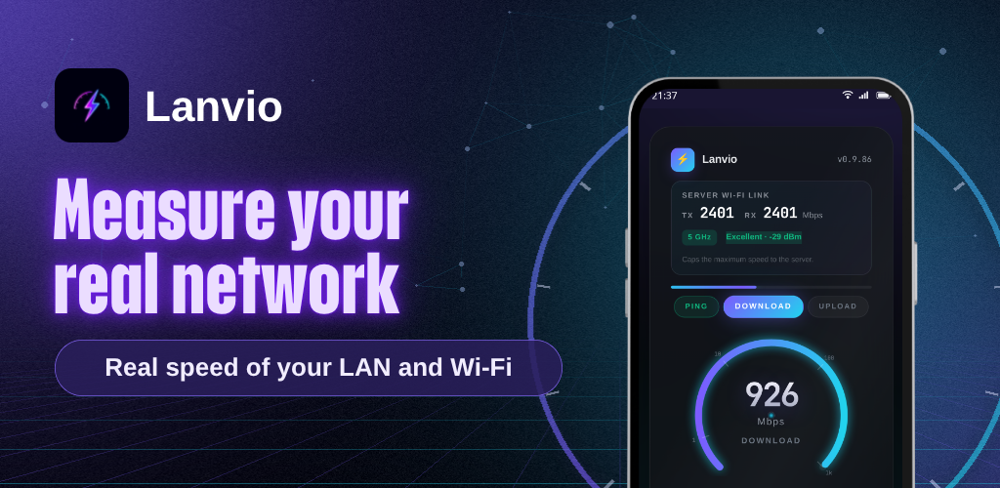
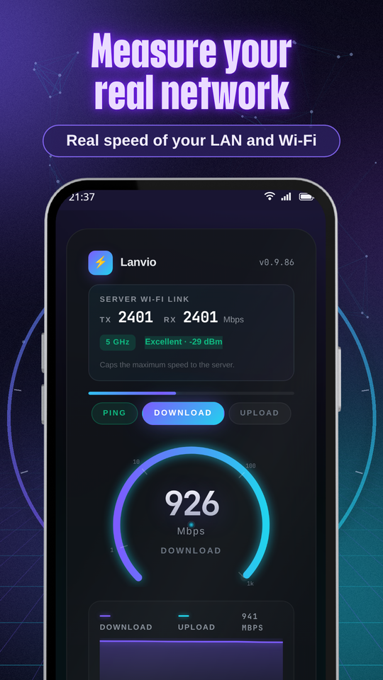
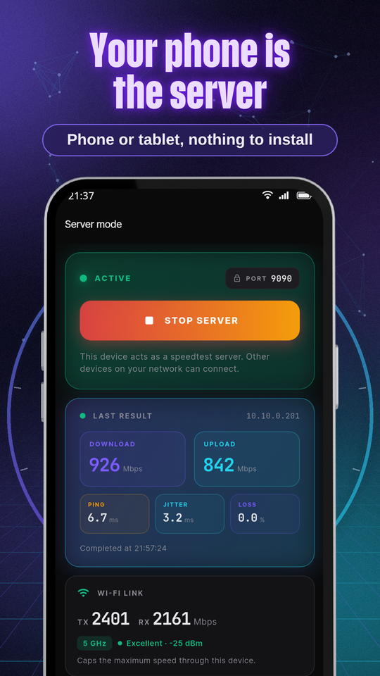
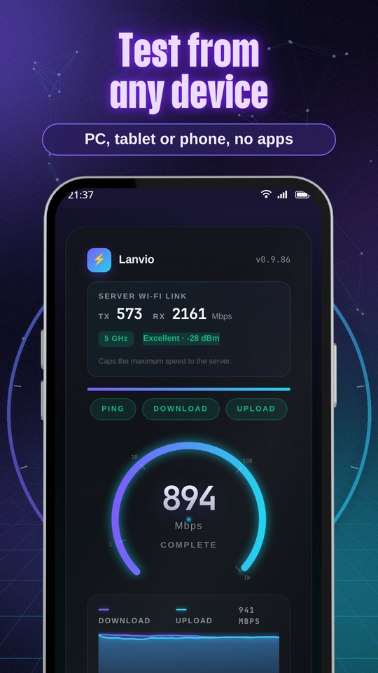
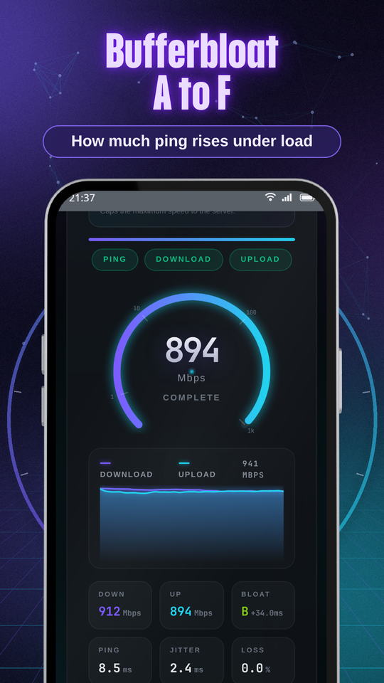
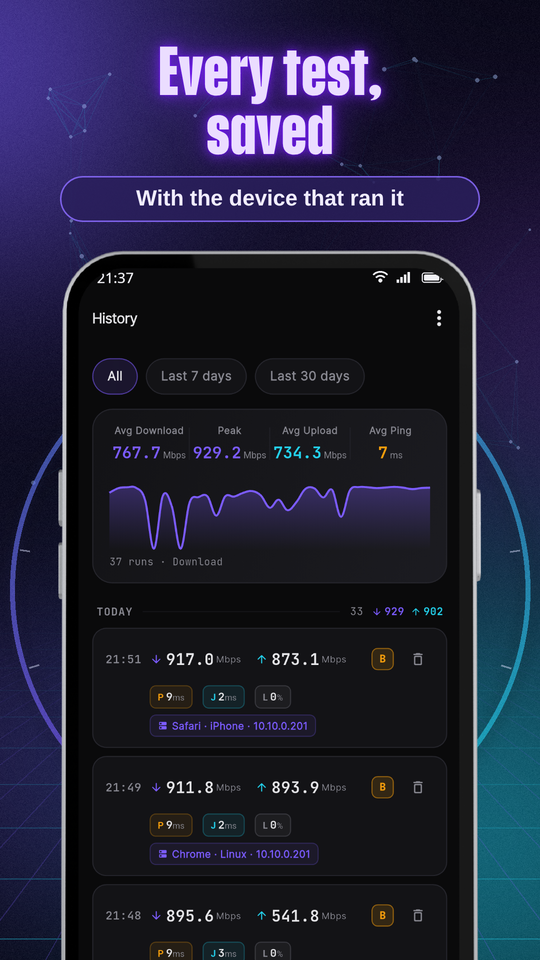
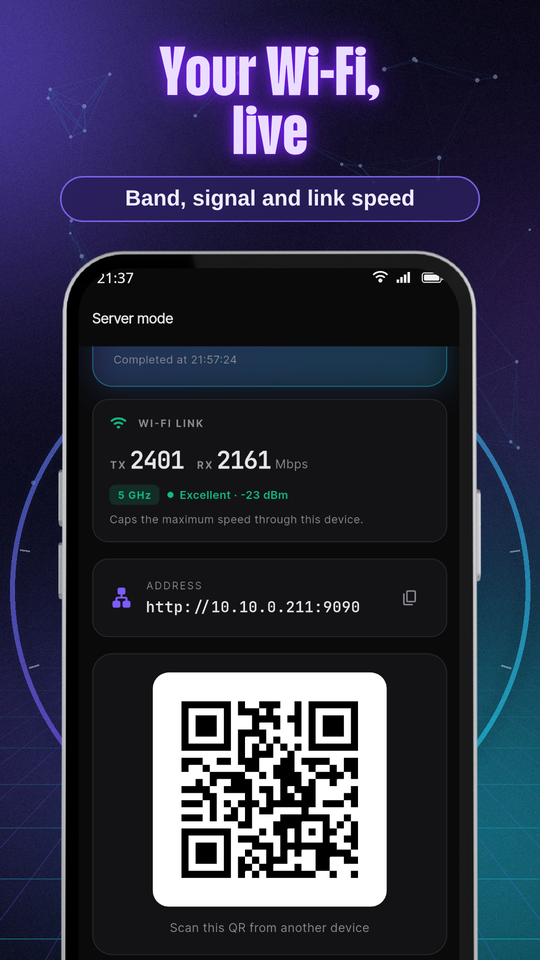
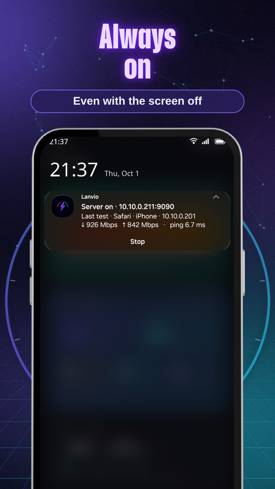
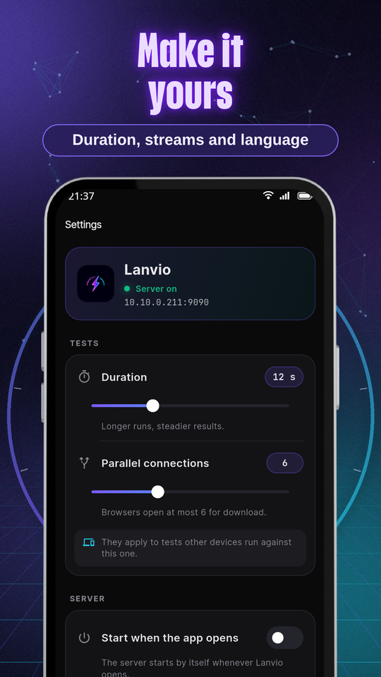

  
  <h1>Lanvio: LAN Speed Test</h1>
  
<b>Measure the real speed of your Wi-Fi and LAN. Your phone is the server.</b>

  

 

  <a href="README.md">🇦🇷 Español</a> | <b>🇺🇸 English</b>

 

> ### 🐛 Found a problem or have an idea?
> **[Open an issue here](../../issues/new/choose)**: every one gets read.
> Please include **your app version** (bottom of Settings) and **which device and browser** ran the test.

---

  

## Your network, really measured

Lanvio turns your phone or tablet into a speed test server for your local network. From a computer, another phone or a tablet, open the address Lanvio shows in any browser and measure the real speed between those devices, over Wi-Fi or cable. Nothing to install on the other end, and no internet involved.

Perfect to find out what your router really delivers, compare 2.4 GHz with 5 GHz, find the spots where Wi-Fi drops, or validate a network install.

  
  
  
  

### 🚀 How it works

1. Start the server in Lanvio: it shows its address and a QR code.
2. On any device on your network, open that address in the browser and tap **Start test**.
3. You can also test from another phone with Lanvio, which finds the servers on your network by itself.

### 📊 What it measures

- Real download and upload speed, in Mbps
- Ping, jitter and packet loss
- Bufferbloat graded A to F: how much latency rises when the network is busy
- The server's Wi-Fi link: band, signal and link speed

### 🔋 Always on

- The server keeps answering with the screen off or the app in the background.
- A notification shows the address, the test in progress and the last result, with a button to stop it.
- Optionally, the server starts by itself when the app opens.

### 🗂️ History

- Every test is saved with the device that ran it (for example "Chrome · Windows").
- Averages, peaks and a chart, with filters by period and by Wi-Fi network.
- CSV export.

### 🎛️ Make it yours

- Test duration and number of parallel connections.
- In English and Spanish, the test page too.

  
  
  
  

---

## ❓ FAQ

**What is bufferbloat?**
It is how much your ping rises while the network is busy. Lanvio compares the ping at rest with the ping during download and upload, and grades the difference: A+ (under 5 ms), A (under 30), B (under 60), C (under 200), D (under 400) and F (400 or more). A poor grade means the router queues too much: video calls and games stutter whenever someone downloads.

**Does it use my mobile data or the internet?**
No. The test runs directly between your devices, inside your network. The internet is only used for the ads in the free version and to buy Lanvio Pro.

**Why does it ask for location?**
Android only lets apps with the location permission read the Wi-Fi network name. It is optional: without it Lanvio works the same, it just doesn't show the network name.

**My result is lower than the link speed. Is something wrong?**
No. The link speed is the theoretical maximum of the Wi-Fi connection; what actually gets through is usually quite a bit less, especially over Wi-Fi.

---

## 🆓 Free

Every feature is free. Lanvio shows ads on the Server and History screens, never on the test page.

**⭐ Lanvio Pro** removes the ads for good. One-time purchase, no subscription.

---

## 🔒 Privacy

- Tests and their results stay on your devices: nothing is sent to EgeaINC servers.
- No user accounts.
- The location permission is optional and only used to read your Wi-Fi network name.
- In the free version, Google AdMob serves the ads. With Lanvio Pro they are not loaded.

📄 [Full privacy policy](PRIVACY_POLICY.md) · 📝 [Changelog](CHANGELOG-en.md)

---

## 📬 Contact

**EgeaINC**, Buenos Aires, Argentina · gabriel600r@gmail.com

More EgeaINC apps on the [developer page](https://play.google.com/store/apps/developer?id=EgeaINC).
