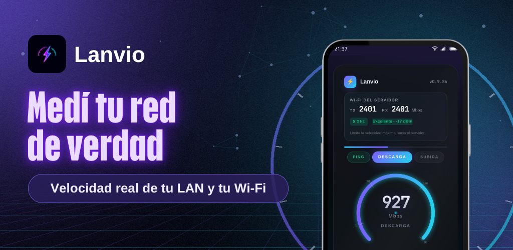
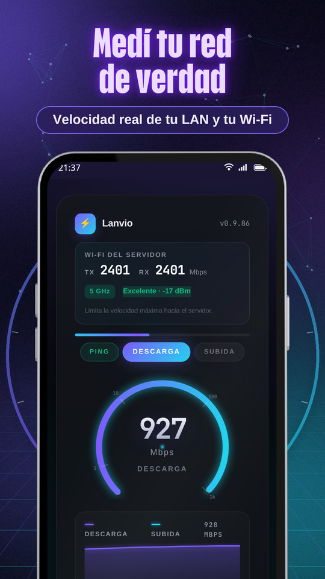
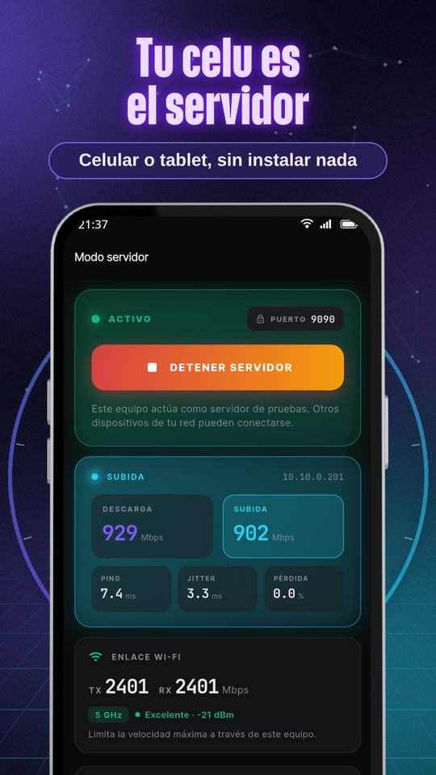
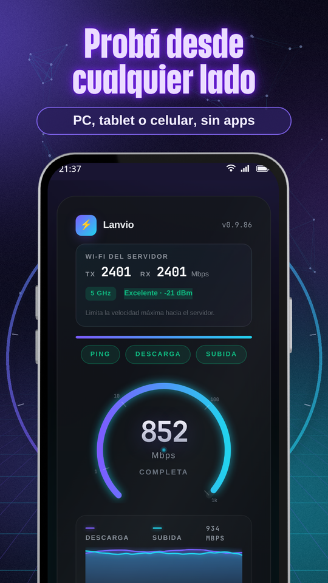
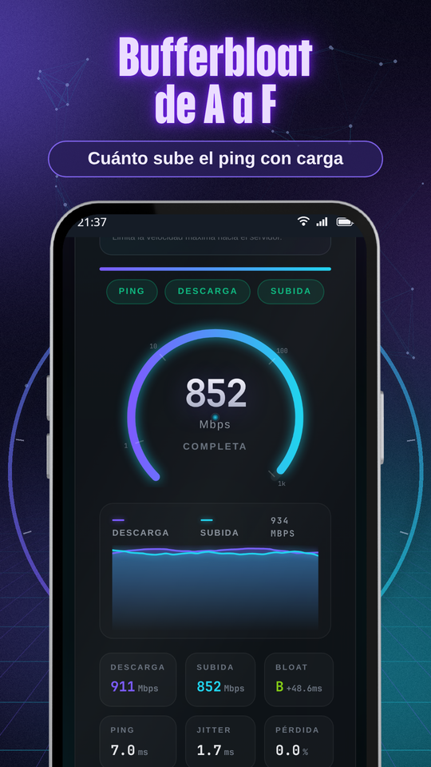
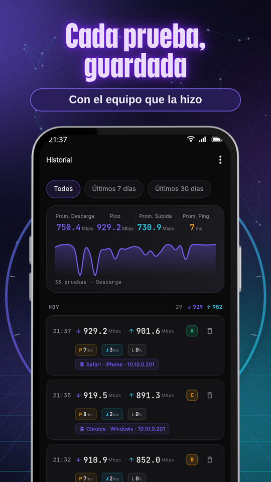
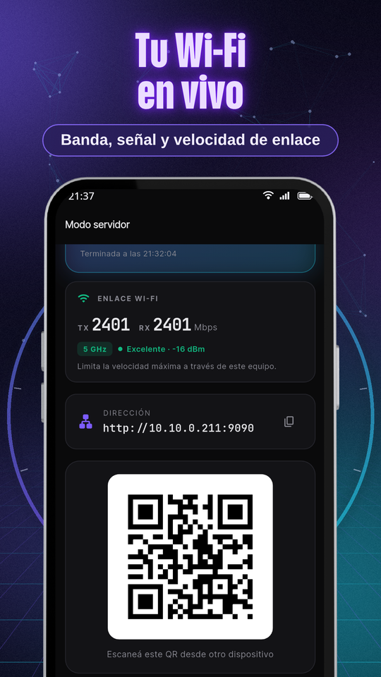
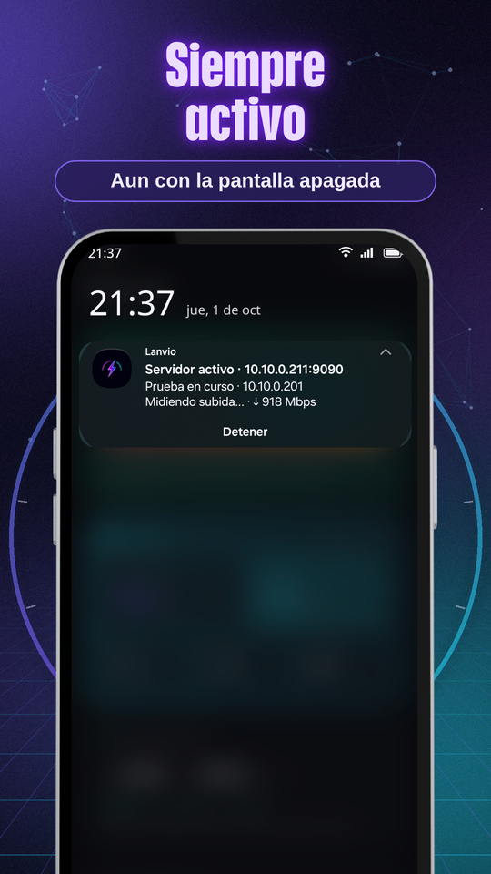
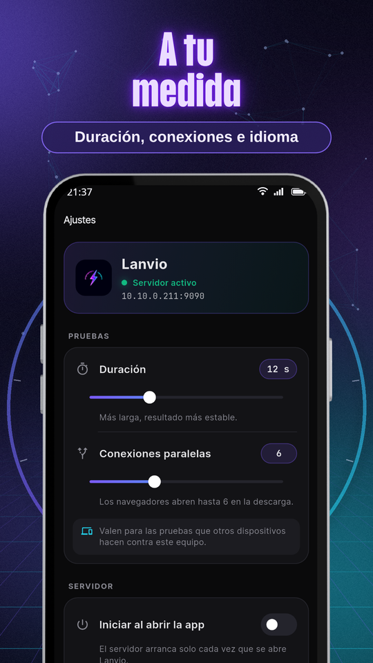

  
  <h1>Lanvio: Test de velocidad LAN</h1>
  
<b>Medí la velocidad real de tu Wi-Fi y tu red local. Tu celu es el servidor.</b>

  

 

  <b>🇦🇷 Español</b> | <a href="README-en.md">🇺🇸 English</a>

 

> ### 🐛 ¿Encontraste un problema o se te ocurre algo?
> **[Abrí un ticket acá](../../issues/new/choose)**: se leen todos.
> Contá **qué versión de la app tenés** (Ajustes, abajo de todo) y **desde qué equipo y navegador** hiciste la prueba.

---

  

## Tu red, medida de verdad

Lanvio convierte tu celular o tablet en un servidor de pruebas de velocidad para tu red local. Desde la computadora, otro celular o una tablet abrís en el navegador la dirección que te muestra Lanvio y medís la velocidad real entre esos equipos, por Wi-Fi o por cable. Sin instalar nada en la otra punta y sin pasar por internet.

Ideal para saber cuánto rinde de verdad tu router, comparar 2,4 GHz con 5 GHz, encontrar los rincones donde el Wi-Fi cae o validar una instalación de red.

  
  
  
  

### 🚀 Cómo funciona

1. Prendés el servidor en Lanvio: te muestra la dirección y un código QR.
2. Desde cualquier equipo de tu red abrís esa dirección en el navegador y tocás **Iniciar prueba**.
3. También podés probar desde otro celular con Lanvio, que encuentra solo los servidores de tu red.

### 📊 Qué mide

- Descarga y subida reales, en Mbps
- Ping, jitter y pérdida de paquetes
- Bufferbloat con nota de A a F: cuánto sube la latencia cuando la red está cargada
- Enlace Wi-Fi del servidor: banda, señal y velocidad de enlace

### 🔋 Siempre activo

- El servidor sigue respondiendo con la pantalla apagada o la app en segundo plano.
- Notificación con la dirección, la prueba en curso y el último resultado, y un botón para detenerlo.
- Opción para que el servidor arranque solo al abrir la app.

### 🗂️ Historial

- Cada prueba queda guardada con el equipo que la hizo (por ejemplo "Chrome · Windows").
- Promedios, picos y gráfico, con filtros por período y por red Wi-Fi.
- Exportación a CSV.

### 🎛️ A tu medida

- Duración de la prueba y cantidad de conexiones en paralelo.
- En español e inglés, también la página de prueba.

  
  
  
  

---

## ❓ Preguntas frecuentes

**¿Qué es el bufferbloat?**
Es cuánto sube el ping cuando la red está ocupada. Lanvio compara el ping en reposo con el ping durante la descarga y la subida, y pone una nota según la diferencia: A+ (menos de 5 ms), A (menos de 30), B (menos de 60), C (menos de 200), D (menos de 400) y F (400 o más). Una nota baja quiere decir que el router acumula demasiada cola: las videollamadas y los juegos se traban cuando alguien descarga.

**¿Usa mis datos móviles o internet?**
No. La prueba va directo entre tus equipos, dentro de tu red. Internet sólo se usa para los anuncios de la versión gratis y para la compra de Lanvio Pro.

**¿Por qué me pide la ubicación?**
Android sólo deja leer el nombre de la red Wi-Fi a las apps con permiso de ubicación. Es opcional: si no lo das, Lanvio funciona igual y no muestra el nombre de la red.

**Mi resultado es más bajo que la velocidad de enlace, ¿está mal?**
No. La velocidad de enlace es el máximo teórico de la conexión Wi-Fi; lo que realmente pasa por la red suele ser bastante menos, sobre todo en Wi-Fi.

---

## 🆓 Todo gratis

Todas las funciones son gratis. Lanvio muestra anuncios en las pantallas Servidor e Historial, nunca en la página de prueba.

**⭐ Lanvio Pro** quita la publicidad para siempre. Pago único, sin suscripción.

---

## 🔒 Privacidad

- Las pruebas y sus resultados quedan en tus equipos: nada se envía a servidores de EgeaINC.
- Sin cuentas de usuario.
- El permiso de ubicación es opcional y sólo sirve para leer el nombre de tu red Wi-Fi.
- En la versión gratis, Google AdMob muestra los anuncios. Con Lanvio Pro no se cargan.

📄 [Política de privacidad completa](PRIVACY_POLICY.md) · 📝 [Historial de cambios](CHANGELOG.md)

---

## 📬 Contacto

**EgeaINC**, Buenos Aires, Argentina · gabriel600r@gmail.com

Otras apps de EgeaINC en la [página de desarrollador](https://play.google.com/store/apps/developer?id=EgeaINC).
